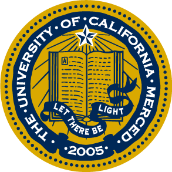
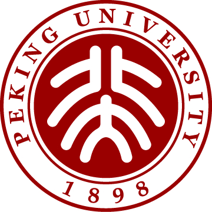

# About Me

I am a senior undergraduate student from School of Eletronic Engineering and Computer Science in **Peking University** with a major in Computer Science, Department of Machine Intelligence.

My research interest lie predominately in **Computer Vision, Machine Learning and Artificial Intelligence**. At present, I have been conducting researches on **Computational Photography**, including Image Restoration and Enhancement, Image Enhancing and Matting, analysis on Generative Models and Realistic Image Quality Assessments.

I am now working as an research assistant under the supervision of Prof. [Ming-Hsuan Yang](https://faculty.ucmerced.edu/mhyang/) *et al.* for discovering Image Generative and Reconstructive models. I am also a Algorithm Researcher (Intern) of Research Group, [Megvii Incorporated](https://megvii.com/) for image enhancement research programs. Since Summer 2019, I have been affliated with *[Visual Inference and Evaluation](https://vie.group/)* Group in Peking University as a research assistant advised by Asso. Prof. Tingting Jiang.

To view my previous and ongoing research projects, please refer to [Publications and Projects](https://timothyhtimothy.github.io/project).

# Experiences

<table style="font-size:18px;border:none">
  <tr>
    <td width='20%' align="center" style="border:none">
      
    </td>
    <td style="border:none;padding-left:40px">
     <b>University of California, Merced, United States</b> 
     Research Assistant | 2020.06 - present 
     <I>Advisor: <a href="https://faculty.ucmerced.edu/mhyang/" target="_blank" rel="noopener">Prof. Ming-Hsuan Yang</a> </I>
    </td>
  </tr>
  <tr height=200px>
    <td width='20%' align="center" style="border:none">
      
    </td>
    <td style="border:none;padding-left:40px">
     <b> Megvii Incorporated, Bejing, China </b> 
     Algorithm Researcher (Intern) | 2020 - 2021 (expected)  
    </td>
  </tr>
  <tr height=200px>
    <td width='20%' align="center" style="border:none">
      
    </td>
    <td style="border:none;padding-left:40px">
     <b>Peking University, Bejing, China </b> 
     Bachelor of Science | 2017 - 2021 (expected)  
     GPA of latest year: 3.88/4.00, GPA overall: 3.51/4.00 
     <I>Advisor: <a href="http://www.vie.group/ttj" target="_blank" rel="noopener">Asso. Prof. Tingting Jiang</a> </I>
    </td>
  </tr>
</table>

# Contact

If you are interested in my research or academic experience, please contact me via email. I will reply ASAP. 
Email: [realtimothyhwu@gmail.com](realtimothyhwu@gmail.com) 

# Acknowledgements

Special thanks to my friends D. Xu and X. Li for advising me on categorizing my research experiences and interests on this website.
